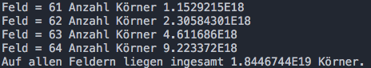
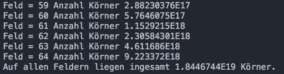
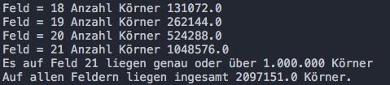

# Weizenkornlegende (16.10.17)
https://de.wikipedia.org/wiki/Sissa_ibn_Dahir

Auf einem Schachbrett liegt auf jedem Feld jeweils die doppelte Anzahl an Weizenkörnern, wie auf dem Feld davor.

Berechne die Anzahl von Weizenkörnern je Feld.

## Lösung mit For-Schleife

`Schachbrett_for.java`

## Lösung mit While-Schleife

`Schachbrett_while.java`

## Lösung mit unterschiedlichen Datentypen im Vergleich

`Schachbrett_datentypen.java`

## Lösung mit Abbruch nach >= 1.000.000 Körnern auf einem Feld

`Schachbrett_1000000.java`

