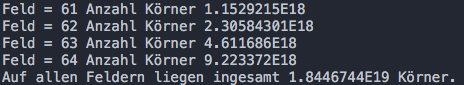
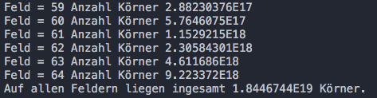
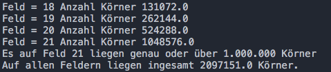
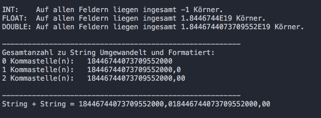

# Weizenkornlegende (16.10.17)
https://de.wikipedia.org/wiki/Sissa_ibn_Dahir

Auf einem Schachbrett liegt auf jedem Feld jeweils die doppelte Anzahl an Weizenkörnern, wie auf dem Feld davor.

Berechne die Anzahl von Weizenkörnern je Feld.

## Lösung mit For-Schleife

`Schachbrett_for.java`

## Lösung mit While-Schleife

`Schachbrett_while.java`

## Lösung mit unterschiedlichen Datentypen im Vergleich

`Schachbrett_datentypen.java`

## Lösung mit Abbruch nach >= 1.000.000 Körnern auf einem Feld

`Schachbrett_1000000.java`

## Lösung mit Ausgabe der Zahlen als Normale Dezimalzahlen

`Schachbrett_dezimalzahlen.java`

https://docs.oracle.com/javase/tutorial/java/data/numberformat.html

Die normale Ausgabe von Zahlen erfolgt in Wissenschaftlicher Schreibweise mit z.B. E5. Um "normale" Dezimalzahlen anzuzeigen, gibt es mehrere Möglichkeiten.
Eine ist, die Zahlen in Strings umzuwandeln.
Nachteil ist allerdings, dass Nachkommastellen vorher bekannt bzw. bestimmt werden müssen und keine Rechenoperationen mit Strings durchgeführt werden können.

